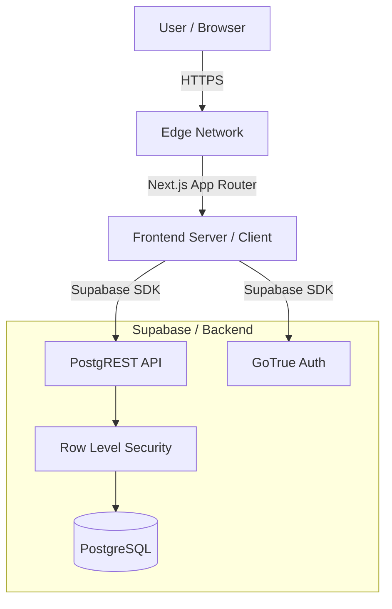

# Architecture & System Design

## Overview
RevenueOS is a multi-tenant financial operating system built on Next.js and Supabase. It uses a "Database-per-row" tenancy model enforced by Row Level Security (RLS).

## High-Level Architecture

## Multi-Tenancy Strategy
- **Isolation**: Shared database, logical isolation via `org_id`.
- **Enforcement**:
    - All queries must include `org_id`.
    - RLS policies prevent cross-tenant access.
    - Application middleware checks for organizational membership.

## Frontend Modules
1.  **Auth Module**: Handles login, signup, and basic user profile management.
2.  **App Module**: The main interface for business users.
    - `dashboard`: High-level metrics.
    - `sales`: Order management.
    - `customers`: Buyer profiles.
    - `payments`: Transaction history.
3.  **Ops Module**: Tools for platform administrators (or advanced org owners) to manage integrations, webhooks, and audit logs.

## Security & Permissions
- **Authentication**: Usage of Supabase Auth (JWT).
- **Authorization**:
    - **RBAC**: Roles stored in `memberships` table (Owner, Admin, Member, Viewer).
    - **RLS**: Database-level enforcement of visibility.

## Data Flow
1.  **Writes**: Direct from client to Supabase for simple CRUD. Server Actions for complex business logic (e.g., refunding a payment matching an order).
2.  **Reads**: Direct from client via supabase-js for listing data.
3.  **Real-time**: Supabase Realtime for critical status updates (optional).
