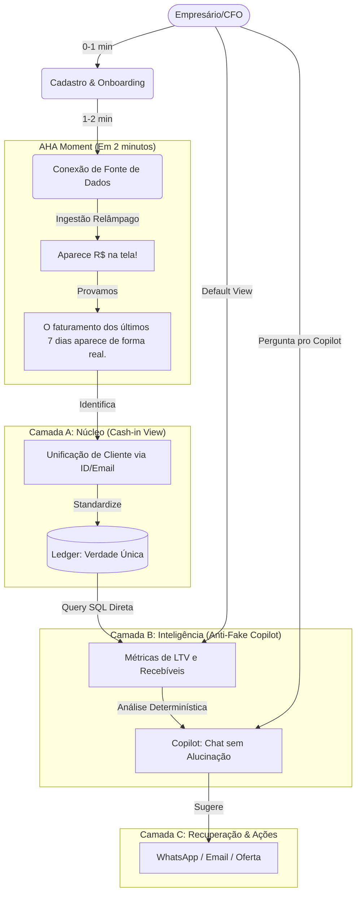

# RevenueOS — Caminho do Cliente (v2)

## 🎯 Visão Geral
O RevenueOS é o **Dashboard de Recebíveis e Inteligência de Caixa** para empresas digitais. Ao contrário de ferramentas de CRM ou ERPs genéricos, o RevenueOS foca no **Cash-in**: o dinheiro que entra, quando entra e quem pagou.

---

## 🏗 Camadas do Produto (A/B/C/D)

Para garantir um produto "redondo" e escalável, dividimos a ferramenta em 4 camadas de maturidade:

| Camada | Nome | Foco | Status |
| :--- | :--- | :--- | :--- |
| **A** | **O Núcleo (Ledger)** | Ingestão Webhook, Normalização e Registro de Recebíveis. | **MVP / Core** |
| **B** | **Inteligência** | Visão de LTV por cliente, Análise de Anomalias e Previsão de Caixa. | **MVP / Core** |
| **C** | **Ações** | Réguas de recuperação (WhatsApp/Email) e automações baseadas em eventos. | **Próximo Passo** |
| **D** | **Expansão** | Open Finance (Bancos) e Integração com Notas Fiscais. | **Futuro (Q3)** |

---

## 🔄 O Caminho do Cliente (Diagrama v2)

---

## 🆔 Identidade do Cliente (Customer Key & Merge Rules)

Para que o "LTV por cliente" funcione entre múltiplas plataformas (ex: mesmo cliente compra via Stripe e Kiwify), aplicamos:
- **`customer_key` primary:** Unificação via `documento (CPF/CNPJ)` (mais forte) ou `email` (mais comum).
- **Merge Automático:** Se um registro entra com o mesmo email de um cliente existente, os históricos de pagamentos são vinculados ao mesmo perfil.
- **Histórico Multi-Fonte:** O perfil do cliente mostra: "Comprou Produto X via Stripe" + "Comprou Produto Y via Hotmart".

---

## 🔐 Garantia "Sem Fakes" no Copilot

O chat/IA do RevenueOS segue uma política rígida de **evidência baseada em dados**:
1.  **Fonte Obrigatória:** Toda resposta deve citar a fonte (ex: "Baseado em 452 eventos do Stripe").
2.  **Período Explícito:** "No período de 01/01 a 15/01...".
3.  **Não-Alucinação:** Se a pergunta exigir dados que não existem no banco, a resposta deverá ser: *"Ainda não tenho dados de faturamento futuros suficientes para essa previsão, mas baseando-se no histórico de X dias..."*.
4.  **Recomendação, não decisão:** A IA nunca altera o status de uma venda; ela aponta a anomalia e sugere a ação.

---

## 🏃 Mapa de Onboarding (Telas + Eventos)

| Tela | Objetivo | Campo Mínimo | O que é 'Done'? |
| :--- | :--- | :--- | :--- |
| `/signup` | Criar identidade do usuário. | Email / Senha. | Usuário autenticado. |
| `/onboarding/org` | Definir a entidade legal. | Nome da Empresa / Slug. | Org criada no DB. |
| `/onboarding/connect` | Conectar a primeira fonte de verdade. | Escolher Provider (ex: Stripe). | Webhook URL gerada. |
| **`/onboarding/aha`** | **O AHA Moment.** | Dashboard rápido pós-teste. | **Visualização de R$ 1,00 ou faturamento real.** |
| `/app/receivables` | A visão padrão (Default View). | - | Visualização do calendário de entrada. |

**AHA Moment:** O sistema detecta o primeiro evento recebido. Se não houver webhook real em 2 minutos, o sistema oferece um "Botão de Envio de Teste" para que o cliente veja a métrica subir imediatamente e entenda o valor do dado normalizado.

---

## ✅ Checklist de Implementação (Auditado)

### Product & UX
- [x] Mudar a página inicial padrão do app (`/app/dashboard`) para focar em **Recebíveis (Cash-in)**.
- [x] Implementar tela de `/onboarding/connect` com logos claros de Stripe/Kiwify.
- [x] Criar modal de "AHA" que celebra o primeiro dado recebido.
- [x] Navbar fixo com botão rápido para o Copilot. (Sidebar Prioritário)

### Data & Intelligence
- [x] Criar Trigger SQL para `customer_merge` automático via email.
- [x] View `customer_ltv_view` agregando dados de todas as fontes por cliente.
- [x] Engine de sugestões determinística (Ex: Faturamento caiu > 15% = Alerta).
- [x] Prompt System do Copilot que proibe alucinação e exige fontes.

### Security & Ops
- [/] Validação de assinatura de Webhook para Kiwify/Stripe/Asaas. (Em progresso)
- [x] Logs de auditoria para cada dado normalizado (origem original preservada).
- [x] RLS (Row Level Security) garantindo `activeOrganization` em todas as queries.

### Infra
- [ ] Rate limits na API de Ingestão para evitar ataques de DOS.
- [ ] Fila Upstash ou similar para processamento assíncrono de Webhooks pesados.

---

## 📢 Promessa Central

> **"RevenueOS: A clareza total sobre o dinheiro que cai no seu caixa hoje, amanhã e daqui a 3 meses."**

- **Dashboard Real:** Chega de planilhas. Tudo o que você vendeu em qualquer plataforma, unificado e limpo.
- **IA que Vigia:** Receba alertas automáticos de anomalias e quedas de faturamento antes que seja tarde.
- **Recuperação de LTV:** Saiba exatamente quem parou de pagar e use dados para trazê-los de volta.
