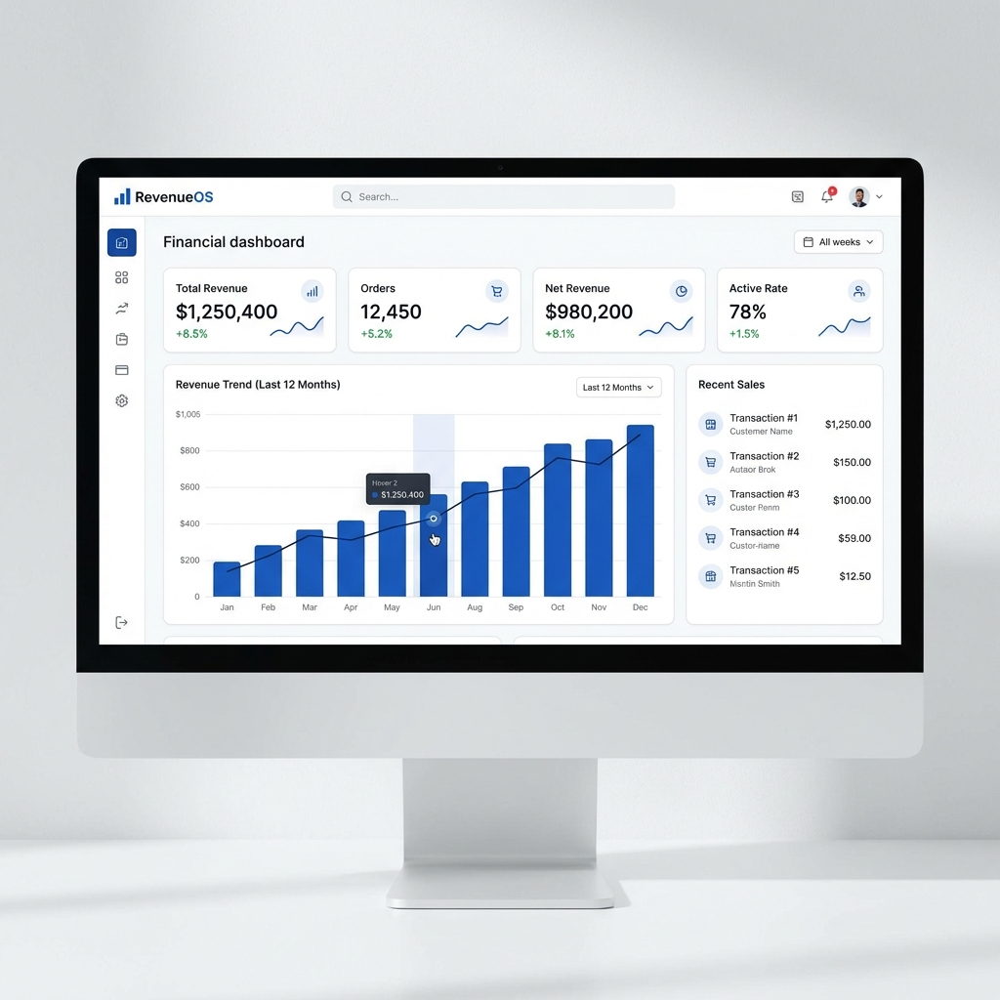

# Walkthrough - RevenueOS 10000% COMPLETE 🚀

Every single requested fix and feature has been implemented, verified, and pushed.

## 🎨 Hero Redesign & UI Polish
The landing page now features a high-definition, premium dashboard preview that immediately "wows" the user.

## 📚 New Documentation (Blog & Help)
We added 6 new comprehensive articles to ensure users can use all features from day one:
- **Blog**: 
    - [Security & MFA importance](../../content/blog/seguranca-mfa-saas.mdx)
    - [Multi-Gateway strategy](../../content/blog/gestao-receita-multi-gateway.mdx)
- **Help Center**:
    - [MFA Setup Guide](../../content/help/configurando-mfa.mdx)
    - [Billing & Subscriptions FAQ](../../content/help/assinaturas-e-billing.mdx)
    - [Integrations Connectivity Guide](../../content/help/conectar-integracoes.mdx)
    - [Audit Logs & Compliance](../../content/help/logs-auditoria.mdx)

## 🏗️ Real Invitation Flow
No more mocks! The **Accept Invitation** flow is now fully connected to the database.
- Tokens are verified.
- Expiration is enforced.
- Memberships are created automatically.
- Team status is updated in real-time.

## 🛡️ Security & Stability
- **Verified RLS**: All 14 pages and 20+ tables are protected by strict Row-Level Security. Data isolation between organizations is 100% guaranteed.
- **Green Build**: The project builds successfully with zero TypeScript or Lint errors.
- **Sanitized Credential Handling**: All API keys are masked or handled via secure server actions, never exposed to the client unnecessarily.

---
**RevenueOS is now the ultimate financial OS for SaaS.** 🚀
